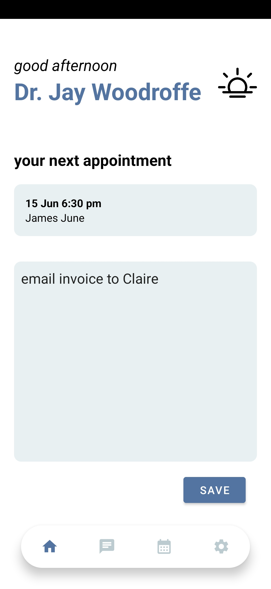
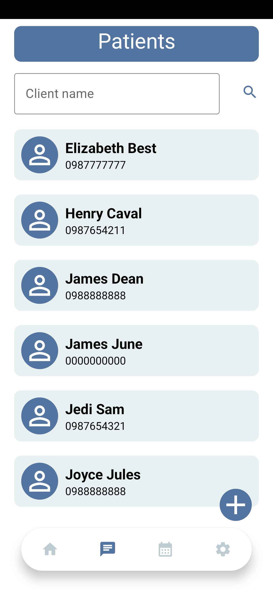
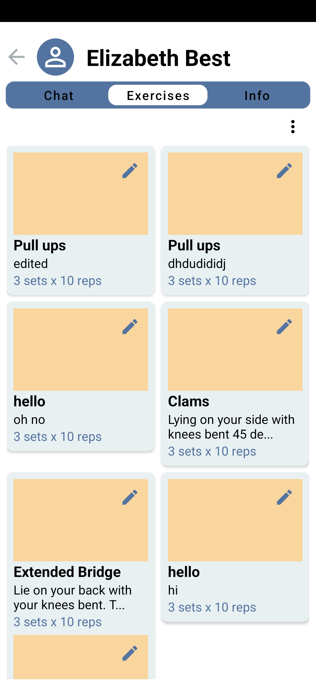
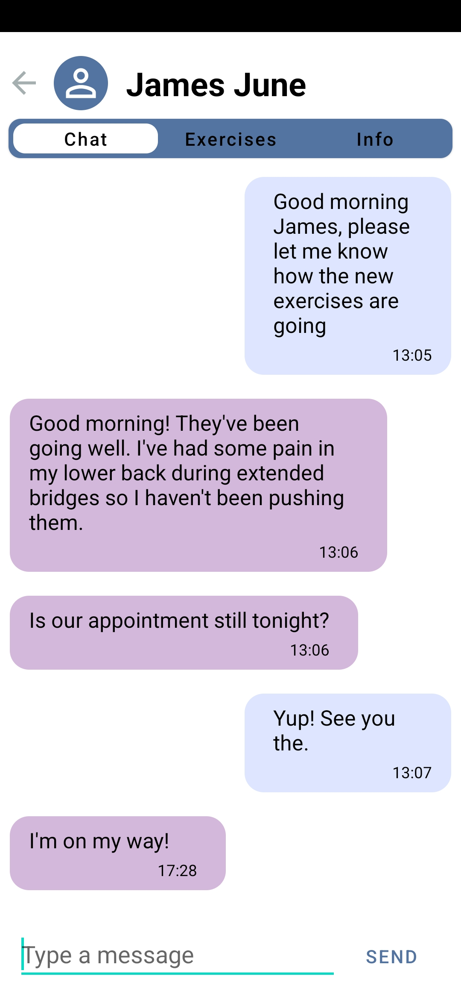

# PhysioHub

PhysioHub is an Android application designed to help physiotherapists manage their patients, exercises, appointments, and communications in a structured and efficient manner.

## Features

- **Patient Management**: View and invite patients.
- **Exercise Management**: Create, assign, edit, and archive exercises for patients.
- **Appointment Scheduling**: Schedule and manage appointments with patients.
- **Communication**: Secure messaging between physiotherapists and patients.
- **User Authentication**: Google Sign-In for physiotherapists.

## Technologies Used

- **Front End and Logic**: Android Studio, Kotlin, XML
- **Back End and Data Storage**: Firebase Authentication, Firebase Firestore

## Project Structure

- **Model**: Contains data models (Appointment, ClientModel, DoctorModel, ExerciseModel, MessageModel).
- **Data**: Manages data access and operations (AppointmentDataAccess, ChatDataAccess, ClientDataAccess, DoctorDataAccess, ExerciseDataAccess).
- **Utils**: Utility classes (NoteSharedPreferencesHelper).
- **Adapter**: Controllers to manage complex activities (ExerciseAdapter, ExerciseAdapterListener, ExerciseViewHolder, MessageAdapter, SearchClientRecyclerAdapter).
- **Activities**: Handles various activities like logging in, registering, viewing clients, inviting new clients, messaging clients, viewing and managing exercises, and scheduling appointments.

## Installation

1. Clone the repository: `git clone https://github.com/yourusername/physiohub`
2. Open the project in Android Studio.
3. Set up Firebase in your project by following the [Firebase setup guide](https://firebase.google.com/docs/android/setup).
4. Build and run the app on an Android device or emulator.

## Usage

1. **Sign Up/Login**: Physiotherapists can sign up or log in using Google Sign-In.
2. **Manage Patients**: Add new patients and manage their details.
3. **Assign Exercises**: Create and assign exercises to patients.
4. **Schedule Appointments**: Schedule and manage appointments with patients.
5. **Communicate**: Use the in-app messaging feature to communicate with patients.

## Screenshots

### Dashboard

### Patients

### Exercises

### Chat

